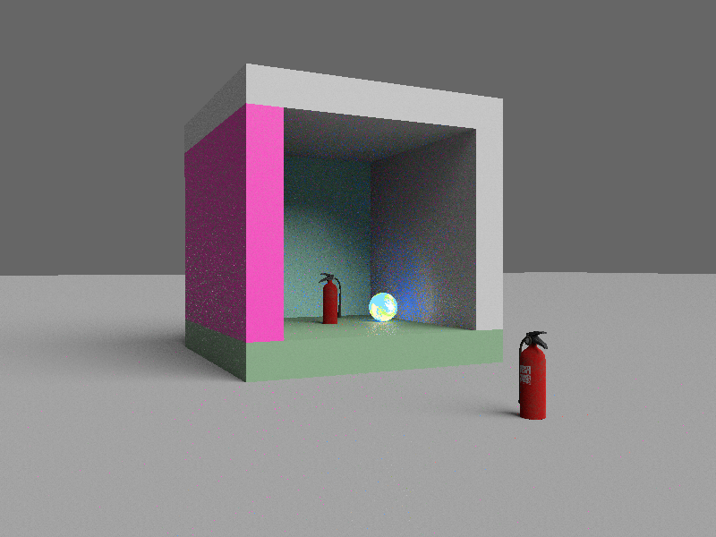
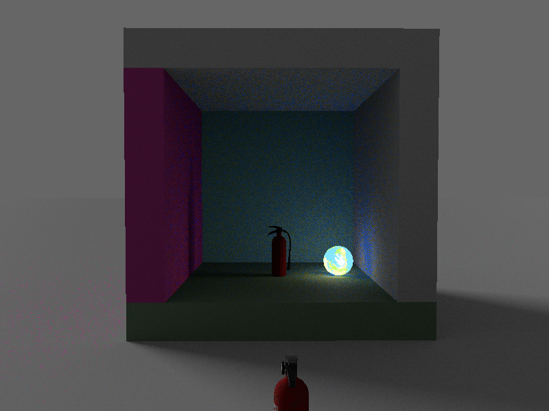
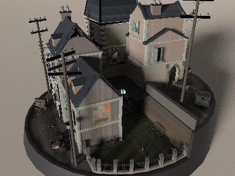
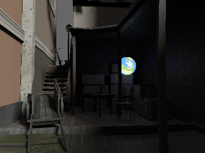
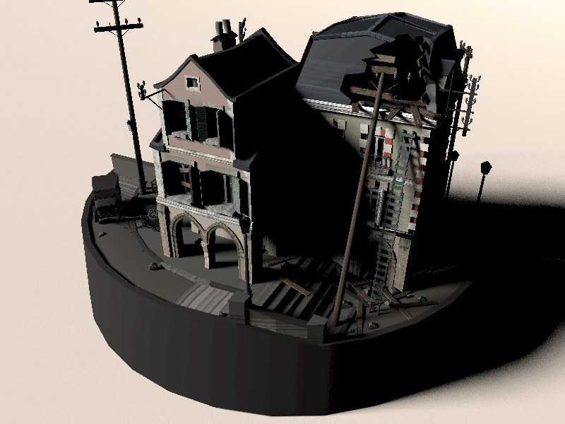
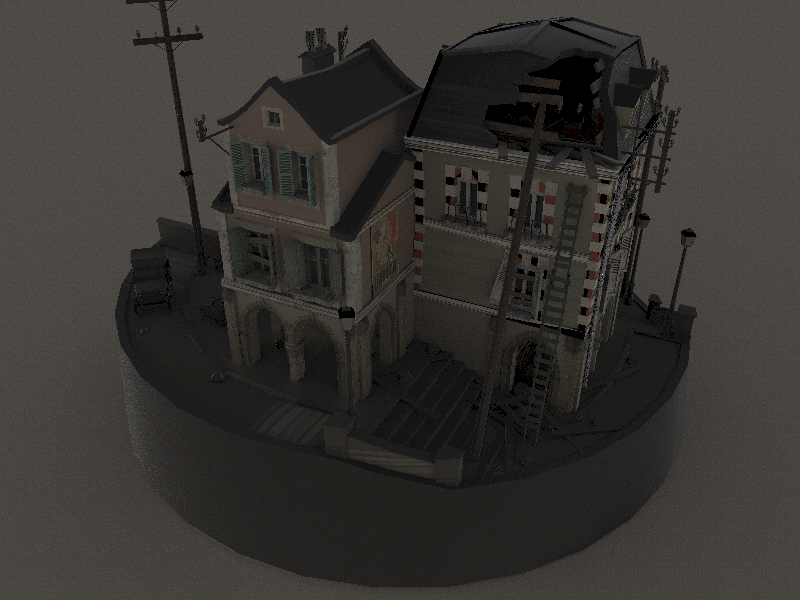

# Realtime Path Tracer for Bevy

[](https://crates.io/crates/bevy-hikari)
[](https://docs.rs/bevy-hikari)

`bevy-hikari` is an implementation of global illumination for [Bevy](https://bevyengine.org/).

After Bevy releasing 0.8, the plugin moves to deferred hybrid path tracing.
For the old version (0.1.x) which uses voxel cone tracing with anisotropic mip-mapping, please check the `bevy-0.6` branch.

## Bevy Version Support
| `bevy` | `bevy-hikari` |
| ------ | ------------- |
| 0.6    | 0.1           |
| 0.8    | In Progress   |

## Progress
- [x] Extraction and preparation of mesh assets and instances
- [x] G-Buffer generation
- [x] 2-bounce path tracing
- [x] Next event estimation
- [x] ReSTIR: Temporal sample reuse
- [ ] ReSTIR: Spatial sample reuse
- [ ] Spatiotemporal filtering
- [ ] Hardware ray tracing (upstream related)

## Basic Usage
1. Add `HikariPlugin` to your `App` after `PbrPlugin`
2. Setup the scene with a directional light
3. Set your camera's `camera_render_graph` to `CameraRenderGraph::new(bevy_hikari::graph::NAME)`

```rust
use bevy::{pbr::PbrPlugin, prelude::*, render::camera::CameraRenderGraph};
use bevy_hikari::prelude::*;
use std::f32::consts::PI;

fn main() {
    App::new()
        .add_plugins(DefaultPlugins)
        .add_plugin(PbrPlugin)
        // Add Hikari after PBR
        .add_plugin(HikariPlugin)
        .add_startup_system(setup)
        .run();
}

fn setup(
    mut commands: Commands,
    mut meshes: ResMut<Assets<Mesh>>,
    mut materials: ResMut<Assets<StandardMaterial>>,
    _asset_server: Res<AssetServer>,
) {
    // Plane
    commands.spawn_bundle(PbrBundle {
        mesh: meshes.add(Mesh::from(shape::Plane { size: 5.0 })),
        material: materials.add(Color::rgb(0.3, 0.5, 0.3).into()),
        ..default()
    });
    // Cube
    commands.spawn_bundle(PbrBundle {
        mesh: meshes.add(Mesh::from(shape::Cube { size: 1.0 })),
        material: materials.add(Color::rgb(0.8, 0.7, 0.6).into()),
        transform: Transform::from_xyz(0.0, 0.5, 0.0),
        ..default()
    });

    // Only directional light is supported
    commands.spawn_bundle(DirectionalLightBundle {
        directional_light: DirectionalLight {
            illuminance: 10000.0,
            ..Default::default()
        },
        transform: Transform {
            translation: Vec3::new(0.0, 5.0, 0.0),
            rotation: Quat::from_euler(EulerRot::XYZ, -PI / 4.0, PI / 4.0, 0.0),
            ..Default::default()
        },
        ..Default::default()
    });

    // Camera
    commands.spawn_bundle(Camera3dBundle {
        // Set the camera's render graph to Hikari's
        camera_render_graph: CameraRenderGraph::new(bevy_hikari::graph::NAME),
        transform: Transform::from_xyz(-2.0, 2.5, 5.0).looking_at(Vec3::ZERO, Vec3::Y),
        ..Default::default()
    });
}
```

## Effects






<p float="left">
    
    
</p>

## License
Just like Bevy, all code in this repository is dual-licensed under either:

* MIT License ([LICENSE-MIT](docs/LICENSE-MIT) or [http://opensource.org/licenses/MIT](http://opensource.org/licenses/MIT))
* Apache License, Version 2.0 ([LICENSE-APACHE](docs/LICENSE-APACHE) or [http://www.apache.org/licenses/LICENSE-2.0](http://www.apache.org/licenses/LICENSE-2.0))

at your option.

## Credits
"Fire Extinguisher" model and textures Copyright (C) 2021 by Cameron 'cron' Fraser.
Released under Creative Commons Attribution-ShareAlike 4.0 International (CC-BY-SA 4.0) license.