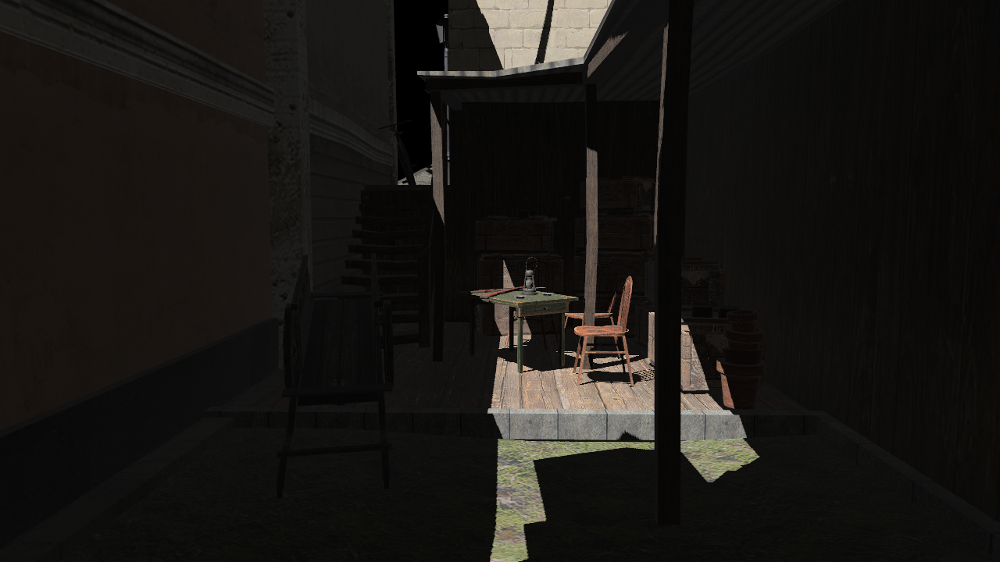
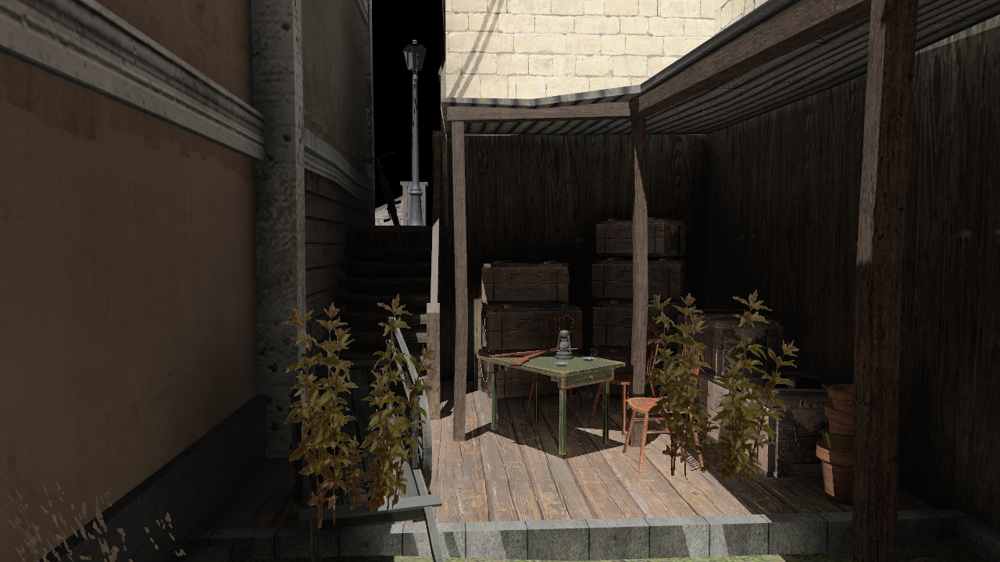

# Bevy Voxel Cone Tracing

`bevy-hikari` is an implementation of voxel cone tracing global illumination with anisotropic mip-mapping in [Bevy](https://bevyengine.org/).

## Bevy Version Support
| `bevy` | `bevy-hikari` |
| ------ | ------------- |
| 0.6    | 0.1           |

## Limitations and Todo
The implementation is very basic and have, but not limited to, the following limitations:
- [ ] Only directional light is supported
- [ ] Only support 256x256x256 voxel grid

Todo:
- [x] Fix flickering
- [x] Voxel HDR support
- [ ] Use memory-efficient voxel structures
- [ ] Correct glossy reflection

## Examples
Two examples are included: one minimal example, one in which can move around and adjust light directions.

You can download and test the compiled examples [here](https://github.com/cryscan/bevy-hikari/releases).

### Effects
No GI:

Has GI:

## License
Just like Bevy, all code in this repository is dual-licensed under either:

* MIT License ([LICENSE-MIT](docs/LICENSE-MIT) or [http://opensource.org/licenses/MIT](http://opensource.org/licenses/MIT))
* Apache License, Version 2.0 ([LICENSE-APACHE](docs/LICENSE-APACHE) or [http://www.apache.org/licenses/LICENSE-2.0](http://www.apache.org/licenses/LICENSE-2.0))

at your option.
