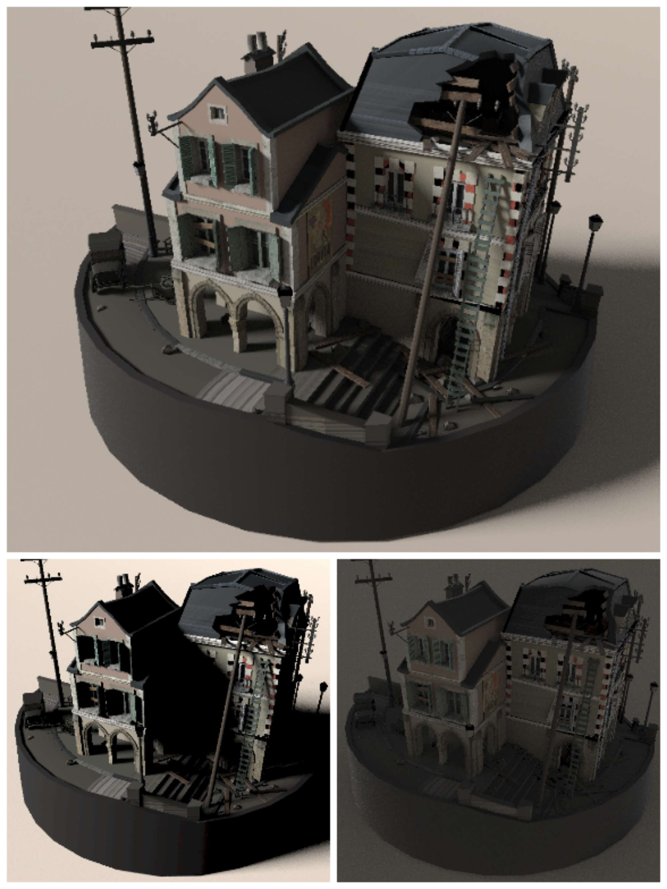

# Realtime Path Tracer for Bevy

`bevy-hikari` is an implementation of global illumination for [Bevy](https://bevyengine.org/).

After Bevy releasing 0.8, the plugin moves to deferred hybrid path tracing.
For the old version (0.1.x) which uses voxel cone tracing with anisotropic mip-mapping, please check the `bevy-0.6` branch.

## Bevy Version Support
| `bevy` | `bevy-hikari` |
| ------ | ------------- |
| 0.6    | 0.1           |
| 0.8    | In Progress   |

## Progress
- [x] Extraction and preparation of mesh assets and instances
- [x] G-Buffer generation
- [x] 2-bounce path tracing
- [x] Next event estimation
- [x] ReSTIR: Temporal sample reuse
- [ ] ReSTIR: Spatial sample reuse
- [ ] Spatiotemporal filtering
- [ ] Hardware ray tracing (upstream related)

## Effects

## License
Just like Bevy, all code in this repository is dual-licensed under either:

* MIT License ([LICENSE-MIT](docs/LICENSE-MIT) or [http://opensource.org/licenses/MIT](http://opensource.org/licenses/MIT))
* Apache License, Version 2.0 ([LICENSE-APACHE](docs/LICENSE-APACHE) or [http://www.apache.org/licenses/LICENSE-2.0](http://www.apache.org/licenses/LICENSE-2.0))

at your option.

## Credits
"Fire Extinguisher" model and textures Copyright (C) 2021 by Cameron 'cron' Fraser.
Released under Creative Commons Attribution-ShareAlike 4.0 International (CC-BY-SA 4.0) license.