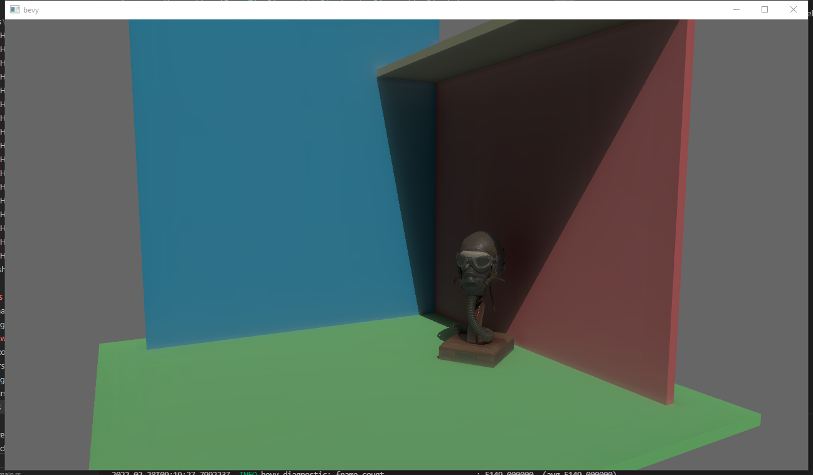

# Bevy Voxel Cone Tracing

`bevy-hikari` is an implementation of voxel cone tracing global illumination with anisotropic mip-mapping in [Bevy](https://bevyengine.org/).

## Controls
| Control              | Binding    |
| -------------------- | ---------- |
| Toggle Lock Cursor   | `Esc`      |
| Move Light Direction | Arrow Keys |

| Cursor Locked            |                    |
| ------------------------ | ------------------ |
| Move Camera Horizontally | `W`, `A`, `S`, `D` |
| Move Camera Up           | `Space`            |
| Move Camera Down         | `Shift`            |

| Cursor Unlocked         |                    |
| ----------------------- | ------------------ |
| Move Model Horizontally | `W`, `A`, `S`, `D` |
| Move Model Up           | `E`                |
| Move Model Down         | `Q`                |