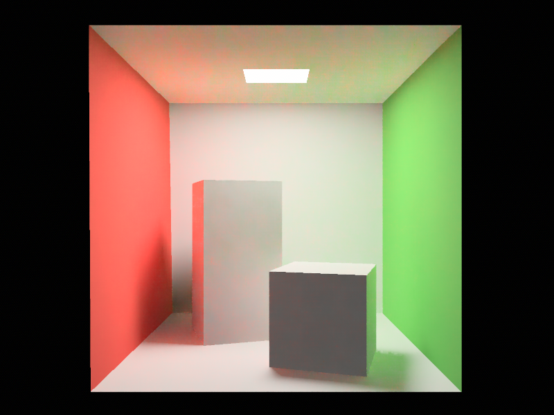

# Realtime Path Tracer for Bevy

[](https://crates.io/crates/bevy-hikari)
[](https://docs.rs/bevy-hikari)

`bevy-hikari` is an implementation of global illumination for [Bevy](https://bevyengine.org/).

After Bevy releasing 0.8, the plugin moves to deferred hybrid path tracing.
For the old version (0.1.x) which uses voxel cone tracing with anisotropic mip-mapping, please check the `bevy-0.6` branch.

:construction: _This project is under heavily development. Certain passes are yet optimized, public interfaces may change between major versions, and minor versions may release very often._

:warning: **Notes:**
- Please run examples with `--release` flag to avoid the texture non-uniform indexing error
- Please compile this libaray in **release mode** when using as a dependency
- Supported meshes must have these 3 vertex attributes: position, normal and uv

## Bevy Version Support
| `bevy` | `bevy-hikari` |
| ------ | ------------- |
| 0.6    | 0.1           |
| 0.8    | 0.2           |
| 0.9    | 0.3           |

## Progress
- [x] Extraction and preparation of mesh assets and instances
- [ ] Asynchronous building of acceleration structures
- [x] G-Buffer generation
- [x] N-bounce indirect lighting
- [ ] Transparency
- [x] Next event estimation
- [x] Better light sampling (L-BVH + Alias table)
- [x] ReSTIR: Temporal sample reuse
- [x] ReSTIR: Spatial sample reuse
- [x] Spatiotemporal filtering
- [x] Temporal anti-aliasing
- [x] Spatial up-scaling (FSR 1.0)
- [x] Temporal up-scaling (SMAA TU4X)
- [ ] Skinned animation
- [x] HDR output
- [x] Bloom
- [ ] Hardware ray tracing (upstream related)

## Basic Usage
1. Add `HikariPlugin` to your `App` after `PbrPlugin`
2. Setup the scene with a directional light
3. Insert [`HikariSettings`](https://docs.rs/bevy-hikari/latest/bevy_hikari/struct.HikariSettings.html) component to the camera

One can configure the renderer through `HikariSettings` component on the camera entity.
Available options are:
```rust
pub struct HikariSettings {
    /// The interval of frames between sample validation passes.
    pub direct_validate_interval: usize,
    /// The interval of frames between sample validation passes.
    pub emissive_validate_interval: usize,
    /// Temporal reservoir sample count is capped by this value.
    pub max_temporal_reuse_count: usize,
    /// Spatial reservoir sample count is capped by this value.
    pub max_spatial_reuse_count: usize,
    /// Max lifetime of a reservoir sample before being replaced with new one.
    pub max_reservoir_lifetime: f32,
    /// Half angle of the solar cone apex in radians.
    pub solar_angle: f32,
    /// Count of indirect bounces.
    pub indirect_bounces: usize,
    /// Threshold for the indirect luminance to reduce fireflies.
    pub max_indirect_luminance: f32,
    /// Clear color override.
    pub clear_color: Color,
    /// Whether to do temporal sample reuse in ReSTIR.
    pub temporal_reuse: bool,
    /// Whether to do spatial sample reuse for emissive lighting in ReSTIR.
    pub emissive_spatial_reuse: bool,
    /// Whether to do spatial sample reuse for indirect lighting in ReSTIR.
    pub indirect_spatial_reuse: bool,
    /// Whether to do noise filtering.
    pub denoise: bool,
    /// Which temporal filtering implementation to use.
    pub taa: Taa,
    /// Which upscaling implementation to use.
    pub upscale: Upscale,
}
```

If you are unsure about some terms in these options, you could check [render passes](#render-passes) for details.

```rust
use bevy::prelude::*;
use bevy_hikari::prelude::*;
use std::f32::consts::PI;

fn main() {
    App::new()
        .add_plugins(DefaultPlugins)
        .add_plugin(HikariPlugin {
            remove_main_pass: true,
        })
        .add_startup_system(setup)
        .run();
}

fn setup(
    mut commands: Commands,
    mut meshes: ResMut<Assets<Mesh>>,
    mut materials: ResMut<Assets<StandardMaterial>>,
    _asset_server: Res<AssetServer>,
) {
    // Plane
    commands.spawn(PbrBundle {
        mesh: meshes.add(Mesh::from(shape::Plane { size: 5.0 })),
        material: materials.add(Color::rgb(0.3, 0.5, 0.3).into()),
        ..default()
    });
    // Cube
    commands.spawn(PbrBundle {
        mesh: meshes.add(Mesh::from(shape::Cube { size: 1.0 })),
        material: materials.add(Color::rgb(0.8, 0.7, 0.6).into()),
        transform: Transform::from_xyz(0.0, 0.5, 0.0),
        ..default()
    });

    // Only directional light is supported
    commands.spawn(DirectionalLightBundle {
        directional_light: DirectionalLight {
            illuminance: 10000.0,
            ..Default::default()
        },
        transform: Transform {
            translation: Vec3::new(0.0, 5.0, 0.0),
            rotation: Quat::from_euler(EulerRot::XYZ, -PI / 4.0, PI / 4.0, 0.0),
            ..Default::default()
        },
        ..Default::default()
    });

    // Camera
    commands.spawn((
        Camera3dBundle {
            // Set `camera_render_graph`
            camera_render_graph: CameraRenderGraph::new(bevy_hikari::graph::NAME),
            transform: Transform::from_xyz(-2.0, 2.5, 5.0).looking_at(Vec3::ZERO, Vec3::Y),
            ..Default::default()
        },
        // Add [`HikariSettings`] component to enable GI rendering
        HikariSettings::default(),
    ));
}
```

## Custom Materials
`bevy-hikari` is built based on `bevy`'s PBR standard material.
A material that is eligible for lighting needs to have surface properties a `StandardMaterial` has (base color, metallic, etc).
In order to render with custom materials,
1. Implement `Into<StandardMaterial>` for the material `CustomMaterial`, and
2. Add `GenericMaterialPlugin::<CustomMaterial>::default()` to the app
3. Add `GenericInstancePlugin::<CustomMaterial>::default()` to the app

## Screenshots
Here are the screenshots of examples.

### Simple


### Cornell (2 Indirect Bounces)


### City (Song Dynasty)


### Scene (WW2)


## Render Passes


## License
Just like Bevy, all code in this repository is dual-licensed under either:

* MIT License ([LICENSE-MIT](docs/LICENSE-MIT) or [http://opensource.org/licenses/MIT](http://opensource.org/licenses/MIT))
* Apache License, Version 2.0 ([LICENSE-APACHE](docs/LICENSE-APACHE) or [http://www.apache.org/licenses/LICENSE-2.0](http://www.apache.org/licenses/LICENSE-2.0))

at your option.

## Credits
- "Fire Extinguisher" model and textures by Cameron 'cron' Fraser.
- "WW2 City Scene" from [sketchfab](https://sketchfab.com/3d-models/ww2-cityscene-carentan-inspired-639dc3d330a940a2b9d7f40542eabdf3).
- "Song Dynasty Architectures" by 唐晨.

## References
- ReSTIR: https://cs.dartmouth.edu/wjarosz/publications/bitterli20spatiotemporal.pdf
- ReSTIR GI: https://d1qx31qr3h6wln.cloudfront.net/publications/ReSTIR%20GI.pdf
- GRIS: https://d1qx31qr3h6wln.cloudfront.net/publications/sig22_GRIS.pdf
- SVGF: https://cg.ivd.kit.edu/publications/2017/svgf/svgf_preprint.pdf
- Filmic SMAA TU: https://www.activision.com/cdn/research/Dynamic_Temporal_Antialiasing_and_Upsampling_in_Call_of_Duty_v4.pdf
